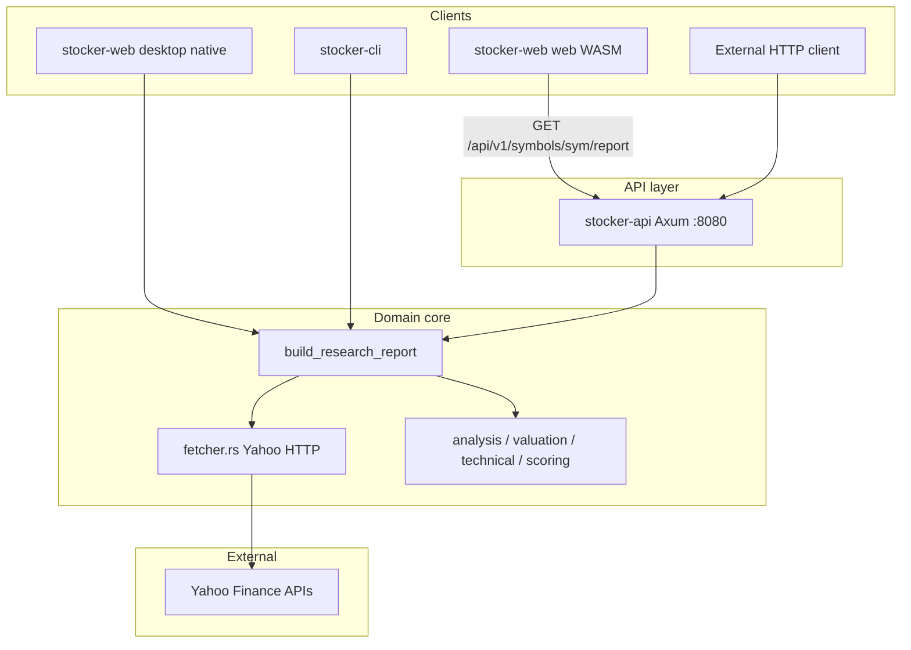
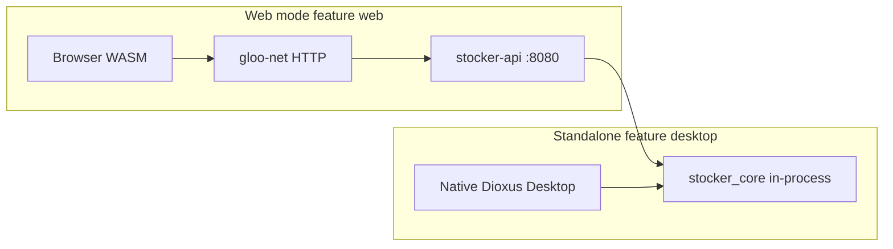
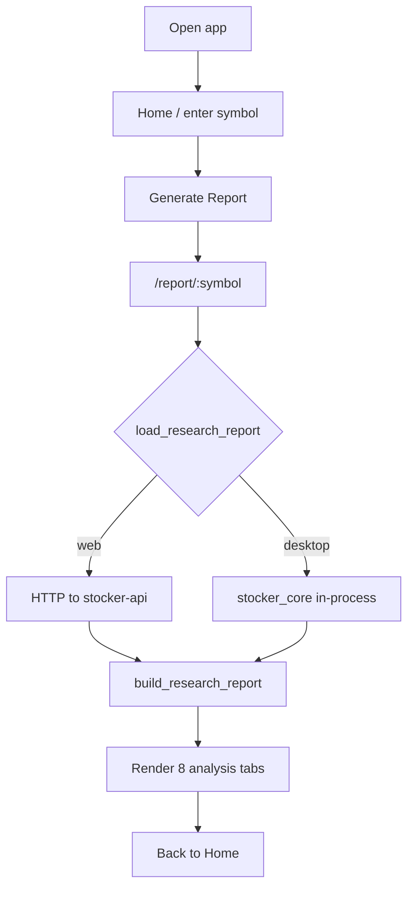

# Stocker Project Knowledge Graph

## Project summary

**stocker** is an NSE-oriented stock research workspace. It fetches data from **Yahoo Finance unofficial HTTP APIs** (the same endpoints Python **yfinance** uses), but implements fetching in Rust via **reqwest** in [`crates/stocker-core/src/fetcher.rs`](../crates/stocker-core/src/fetcher.rs) — there is no Python yfinance dependency.

---

## Workspace entities (crates)

| Node | Path | Role |
|------|------|------|
| **stocker-core** | [`crates/stocker-core/`](../crates/stocker-core/) | Fetch, models, analysis, `build_research_report` |
| **stocker-api** | [`crates/api/`](../crates/api/) | Axum HTTP server on `127.0.0.1:8080` |
| **stocker-cli** | [`crates/cli/`](../crates/cli/) | Headless: symbol → JSON stdout |
| **stocker-web** | [`frontend/`](../frontend/) | Dioxus UI (not Tauri, not npm) |

Workspace root: [`Cargo.toml`](../Cargo.toml)

---

## Backend architecture

### Core modules ([`stocker-core/src/`](../crates/stocker-core/src/))

| Module | Responsibility |
|--------|----------------|
| `fetcher.rs` | Yahoo HTTP, crumb auth, JSON parsing |
| `symbol.rs` | `RELIANCE` → `RELIANCE.NS` |
| `models.rs` | Serde types (`Financials`, `ResearchReport` inputs, etc.) |
| `report.rs` | Orchestration: parallel fetch → analysis → `ResearchReport` |
| `analysis.rs` | Stock, management, sector, peer heuristics |
| `fundamental_analysis.rs` | Statement-based fundamentals |
| `valuation_analysis.rs` | Multiples, historical bands, peer compare |
| `technical_analysis.rs` | SMA, RSI, MACD, volume, ATR from chart bars |
| `technical_entry_signal.rs` | Entry zone heuristics |
| `stock_scoring.rs` | Composite `ResearchRating` |
| `research_summary.rs` | `CompanyOverview`, `ResearchSummary` |

### API surface ([`crates/api/src/lib.rs`](../crates/api/src/lib.rs))

- `GET /health` → `{"status":"ok"}`
- `GET /api/v1/symbols/{symbol}/report` → `ResearchReport` JSON (calls `stocker_core::build_research_report`)

### Entry points → core

| Entry | Invocation |
|-------|------------|
| CLI | `stocker_core::build_research_report(&symbol)` |
| API | Same, via [`handlers.rs`](../crates/api/src/handlers.rs) |
| Desktop UI | Direct in [`frontend/src/api.rs`](../frontend/src/api.rs) (`feature = "desktop"`) |
| Web UI | HTTP to API (`feature = "web"`) |

---

## Frontend: web vs desktop (standalone)

Single crate **stocker-web** with **mutually exclusive** Cargo features ([`frontend/Cargo.toml`](../frontend/Cargo.toml), [`frontend/src/main.rs`](../frontend/src/main.rs)):

| Mode | Feature | Target | Backend connection | API required? |
|------|---------|--------|-------------------|---------------|
| **Web / API mode** | `web` (default) | `wasm32-unknown-unknown` | `GET {STOCKER_API_URL}/api/v1/symbols/{sym}/report` | Yes |
| **Desktop / standalone** | `desktop` | Native OS binary | `stocker_core::build_research_report` | No |

Central switch in [`frontend/src/api.rs`](../frontend/src/api.rs):

- **Web:** `gloo_net::Request::get` + JSON deserialize into `web_types::ResearchReport`
- **Desktop:** `stocker_core::build_research_report(&symbol).await`

WASM cannot link `stocker-core` (no native HTTP stack on wasm32); standalone direct mode is **native desktop only**.

### UI routes and tabs

- Routes: [`frontend/src/routes.rs`](../frontend/src/routes.rs) — `/` (home), `/report/:symbol`
- Report page: 8 tabs — Overview, Research, Financials, Sector, Peers, News, Management, Framework ([`frontend/src/report/tabs/`](../frontend/src/report/tabs/))

---

## Yahoo / yfinance data source

**Clarification:** The project does not call the yfinance Python library. It calls Yahoo’s unofficial REST APIs directly (documented in README as “same endpoints Python yfinance uses”).

### Endpoints used

| Endpoint | Purpose |
|----------|---------|
| `query2.finance.yahoo.com/v10/finance/quoteSummary/{symbol}?modules=...` | Price, financials, profile, statements, holders |
| `query1.finance.yahoo.com/v8/finance/chart/{symbol}?interval=1d&range=5y` | OHLCV history |
| `query2.finance.yahoo.com/v1/finance/search` | Company news, sector news, NSE peer discovery |
| Crumb flow: `fc.yahoo.com` → `finance.yahoo.com` → `getcrumb` | Auth cookie + crumb for quoteSummary |

### quoteSummary modules requested (by fetch function)

| Fetch function | Yahoo `modules` |
|----------------|-----------------|
| `fetch_price` | `price` |
| `fetch_financials` | `financialData,defaultKeyStatistics,summaryDetail,price` |
| `fetch_shareholders` | `majorHoldersBreakdown,netSharePurchaseActivity` |
| `fetch_annual_reports` | `incomeStatementHistory` |
| `fetch_officer_pay` / profile | `assetProfile` |
| `fetch_asset_profile` | `assetProfile,price` |
| `fetch_statement_bundle` | `incomeStatementHistory,incomeStatementHistoryQuarterly,balanceSheetHistory,balanceSheetHistoryQuarterly,cashflowStatementHistory,cashflowStatementHistoryQuarterly` |
| `fetch_peer_quotes` | `price,financialData,summaryDetail,assetProfile,defaultKeyStatistics` |

---

## Scraped values (Yahoo JSON fields → app models)

Values are read from nested JSON, typically `.raw` (numbers) or `.fmt` (dates/strings).

### Price module → quote / `Financials` (partial)

`regularMarketPrice`, `regularMarketChangePercent`, `regularMarketPreviousClose`, `fiftyTwoWeekHigh`, `fiftyTwoWeekLow`, `marketCap`, `regularMarketVolume`, `averageDailyVolume10Day`, `longName`, `shortName`, `symbol`, `exchange`, `fullExchangeName`, `currency`

### financialData module → `Financials`

`totalRevenue`, `netIncomeToCommon`, `totalDebt`, `ebitda`, `profitMargins`, `grossMargins`, `operatingMargins`, `ebitdaMargins`, `returnOnEquity`, `returnOnAssets`, `returnOnCapital`, `returnOnInvestedCapital`, `debtToEquity`, `freeCashflow`, `operatingCashflow`, `enterpriseValue`, `totalCash`, `revenueGrowth`, `earningsGrowth`

### summaryDetail module → `Financials`

`trailingPE`, `forwardPE`, `previousClose`, `dividendYield`, `payoutRatio`, `beta`, `priceToSalesTrailing12Months`, `priceToBook`, `exDividendDate`

### defaultKeyStatistics module → `Financials`

`bookValue`, `priceToBook`, `trailingEps`, `forwardEps`, `sharesOutstanding`, `beta`, `priceToSalesTrailing12Months`

### incomeStatementHistory (annual rows) → `AnnualReport` / statements

`endDate`, `totalRevenue`, `costOfRevenue`, `grossProfit`, `ebitda`, `operatingIncome`, `netIncome`, `dilutedEPS`, `basicEPS`

### balanceSheetHistory → `BalanceSheetRow`

`endDate`, `cash`, `cashAndCashEquivalents`, `otherShortTermInvestments`, `totalDebt`, `longTermDebt`, `shortLongTermDebtTotal`, `currentDebt`, `totalStockholderEquity`, `commonStockTotalEquity`, `totalAssets`, `totalLiab`, `totalLiabilitiesNetMinorityInterest`, `currentAssets`, `currentLiabilities`, `interestExpense`, `inventory`, `netReceivables`

### cashflowStatementHistory → `CashflowRow`

`endDate`, `totalCashFromOperatingActivities`, `operatingCashflow`, `capitalExpenditures`, `freeCashflow`

### majorHoldersBreakdown / netSharePurchaseActivity → `Shareholders`

`insidersPercentHeld`, `institutionsPercentHeld`, `institutionsFloatPercentHeld`, `heldPercentInsiders`, `netInfoShares`

### assetProfile → `AssetProfile` / management proxy

`sector`, `industry`, `longBusinessSummary`, `website`, `country`, `longName`, `companyOfficers[].totalPay`

### Chart API → `ChartBar` / technical analysis

`timestamp`, `indicators.quote[0].open`, `high`, `low`, `close`, `volume` (5y daily range in report build)

### Search API → `NewsItem` / peers

- **News:** `news[].title`, `link`, `providerPublishTime`
- **Peers:** `quotes[].symbol`, `quoteType` (filter `EQUITY`, suffix `.NS`)

---

## High-level report generation flow

### Pipeline stages inside `build_research_report` ([`report.rs`](../crates/stocker-core/src/report.rs))

1. **Normalize** symbol to `*.NS` via [`symbol.rs`](../crates/stocker-core/src/symbol.rs)
2. **Parallel fetch** (8 calls via `tokio::join!`): price, financials, shareholders, annual reports, officer pay, asset profile, statement bundle, 5y chart
3. **Enrich** net income from annual reports if Yahoo TTM is ≤ 0
4. **News**: company news (search by symbol/name/sector/industry), sector news
5. **Peers**: discover NSE peer symbols → batch `fetch_peer_quotes`
6. **Analyze**: stock, management, sector, peer, insights, structured sections, fundamentals, valuation, technical, entry signal, research rating, summary
7. **Return** `ResearchReport` with ~20 top-level fields (symbol, price, financials, analyses, news, ratings, etc.)

### User journey (UI)

---

## Knowledge graph node index (for reference)

**Components:** `stocker-core`, `stocker-api`, `stocker-cli`, `stocker-web`  
**Modes:** `web+HTTP`, `desktop-standalone`, `cli-headless`  
**External:** `YahooFinance` (quoteSummary, chart, search, crumb)  
**Key artifacts:** `ResearchReport`, `Financials`, `ChartHistory`, `PeerQuote`, `NewsItem`  
**Key process:** `build_research_report`  
**UI surfaces:** Home, Report (8 tabs)
